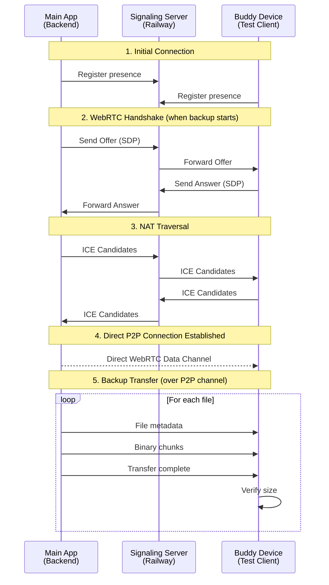
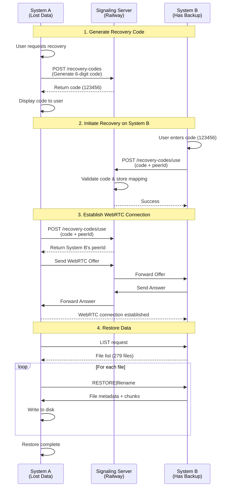

```mermaid
sequenceDiagram
    participant Backend as Main App<br/>(Backend)
    participant Signal as Signaling Server<br/>(Railway)
    participant Buddy as Buddy Device<br/>(Test Client)
    
    Note over Backend,Buddy: 1. Initial Connection
    Backend->>Signal: Register presence
    Buddy->>Signal: Register presence
    
    Note over Backend,Buddy: 2. WebRTC Handshake (when backup starts)
    Backend->>Signal: Send Offer (SDP)
    Signal->>Buddy: Forward Offer
    Buddy->>Signal: Send Answer (SDP)
    Signal->>Backend: Forward Answer
    
    Note over Backend,Buddy: 3. NAT Traversal
    Backend->>Signal: ICE Candidates
    Signal->>Buddy: ICE Candidates
    Buddy->>Signal: ICE Candidates
    Signal->>Backend: ICE Candidates
    
    Note over Backend,Buddy: 4. Direct P2P Connection Established
    Backend-->>Buddy: Direct WebRTC Data Channel
    
    Note over Backend,Buddy: 5. Backup Transfer (over P2P channel)
    loop For each file
        Backend->>Buddy: File metadata
        Backend->>Buddy: Binary chunks
        Backend->>Buddy: Transfer complete
        Buddy->>Buddy: Verify size
    end
```

## Disaster Recovery Flow

```mermaid
sequenceDiagram
    participant System_A as System A<br/>(Lost Data)
    participant Signal as Signaling Server<br/>(Railway)
    participant System_B as System B<br/>(Has Backup)
    
    Note over System_A,System_B: 1. Generate Recovery Code
    System_A->>System_A: User requests recovery
    System_A->>Signal: POST /recovery-codes<br/>(Generate 6-digit code)
    Signal-->>System_A: Return code (123456)
    System_A->>System_A: Display code to user
    
    Note over System_A,System_B: 2. Initiate Recovery on System B
    System_B->>System_B: User enters code (123456)
    System_B->>Signal: POST /recovery-codes/use<br/>(code + peerId)
    Signal->>Signal: Validate code & store mapping
    Signal-->>System_B: Success
    
    Note over System_A,System_B: 3. Establish WebRTC Connection
    System_A->>Signal: POST /recovery-codes/use<br/>(code + peerId)
    Signal-->>System_A: Return System B's peerId
    System_A->>Signal: Send WebRTC Offer
    Signal->>System_B: Forward Offer
    System_B->>Signal: Send Answer
    Signal->>System_A: Forward Answer
    System_A-->>System_B: WebRTC connection established
    
    Note over System_A,System_B: 4. Restore Data
    System_A->>System_B: LIST request
    System_B-->>System_A: File list (279 files)
    loop For each file
        System_A->>System_B: RESTORE|filename
        System_B->>System_A: File metadata + chunks
        System_A->>System_A: Write to disk
    end
    System_A->>System_A: Restore complete
```