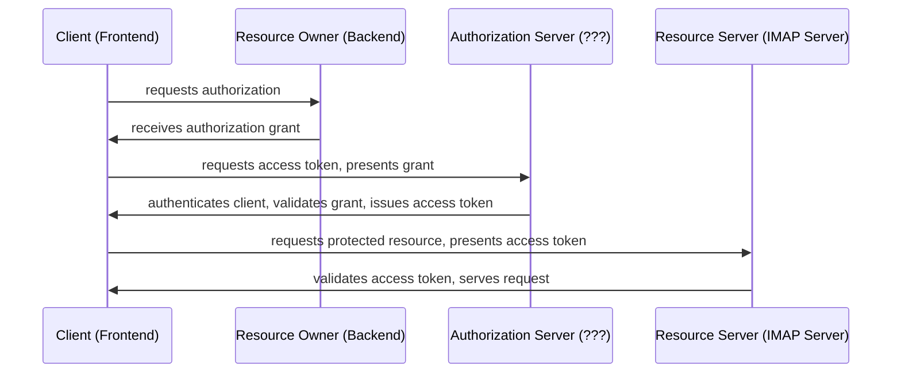

# Authentication flow for OAuth
From https://gist.github.com/cseeman/cf1a0cf7d931794d78f570e9f413f4a1

```mermaid
sequenceDiagram;
    participant C as Client (Frontend)
    participant O as Resource Owner (Backend)
    participant A as Authorization Server (???)
    participant R as Resource Server (IMAP Server)
    
    C->>O: requests authorization 
    O->>C: receives authorization grant
    C->>A: requests access token, presents grant
    A->>C: authenticates client, validates grant, issues access token
    C->>R: requests protected resource, presents access token
    R->>C: validates access token, serves request
```
